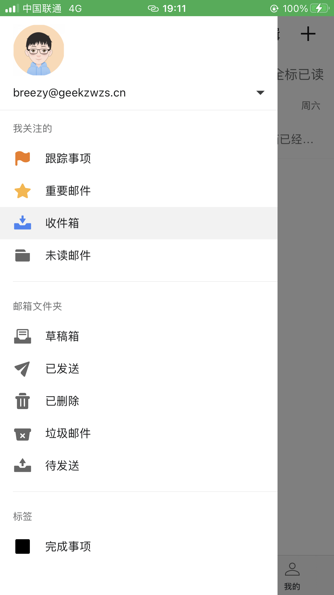
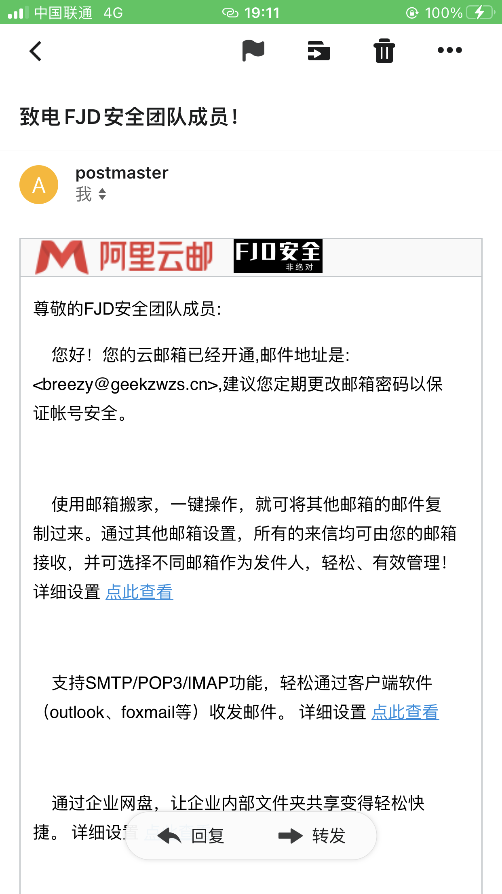

## 介绍

### 起因

在FJD的Github组织的资料里需要填写一个邮箱并且它会显示在组织的主页，很显然这不能使用个人邮箱毕竟这是团队的联系方式。所以它诞生了：[fjd@geekzwzs.cn](fjd@geekzwzs.cn)。

 ### 架构

由阿里云企业邮箱提供服务，在域名geekzwzs.cn上添加了MX解析记录；邮箱有一个管理员账户[postmaster@geekzwzs.cn](postmaster@geekzwzs.cn)，用于登录后台添加、删除邮箱账户；一个[fjd@geekzwzs.cn](fjd@geekzwzs.cn)为团队邮箱；每个邮箱存储容量5GB，可分配51个邮箱账户，共250GB。

## 它能做什么？

### 1、一个团队的象征

总会有人联系我们团队，拥有专属的域名邮箱能增加团队影响力。

其次，团队邮箱密码将在团队内公开；所有成员皆可登录，每个人都能方便的查看来自远方朋友对我们团队的问候

### 2、提高团队成员参与感

每个成员都能获得一个由成员自定义前缀的团队邮箱，例如：[breezy@geekzwzs.cn](breezy@geekzwzs.cn)(Deng-Xian-Sheng-风飞扬)

当你留下这个邮箱作为联系方式的时候，当你用这个邮箱向某人发邮件的时候；他们会感到惊奇(你的邮箱好特别！他们会觉得这好酷！既不是@sina.com也不是@163.com仍不是@qq.com……)

## 如何获得成员专属邮箱

### 1、通过FJD的QQ群发送您想要的自定义前缀给群主

可选的设定：

- 邮箱的名字，这是不可重复的，可以理解为邮箱的昵称，默认为您自定义的邮箱前缀。

* 是否开启POP3/SMTP与IMAP/SMTP服务，该服务用于客户端登录或者代收发邮件的程序例如WordPress，默认均开启。
* 是否开启帐号安全问题设置以及绑定手机号，默认开启。

### 2、通过FJD的QQ群群公告引导获得

> (创建邮箱后，首次登录会强制您修改密码)

## 它如何使用？

### 登录

登录地址：[https://qiye.aliyun.com](https://qiye.aliyun.com)，或者百度搜索：阿里云企业邮箱

### 界面

先放几张截图：

手机APP：

### 安全性

邮箱默认开启安全问题并绑定手机号，新IP或客户端登录均要求短信验证码；邮箱账户创建后将强制您修改密码。

**关于隐私：目前，邮箱管理员账户只能查询收发信的邮箱、登录记录；无法得知信件内容；阿里云也未提供此服务。我们对您的信件也不感兴趣。**

### 个性化

[^(Deng-Xian-Sheng-风飞扬)]: 于2022-1-4最后一次编辑

